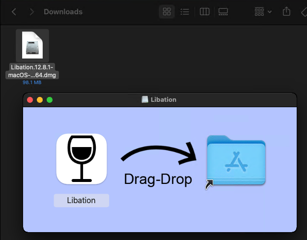
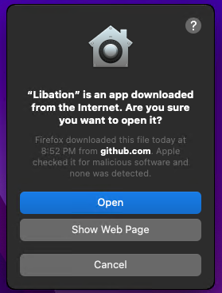

## [Download Libation](https://github.com/rmcrackan/Libation/releases/latest)

### If you found this useful, tell a friend. If you found this REALLY useful, you can click here to [PayPal.me](https://paypal.me/mcrackan?locale.x=en_us)
...or just tell more friends. As long as I'm maintaining this software, it will remain **free** and **open source**.


# Run Libation on MacOS
This walkthrough should get you up and running with Libation on your Mac.

## Supports macOS 13 (Ventura) and above

## Install Libation

- Download the file from the latest release and extract it.
  - Apple Silicon (M1, M2, ...): `Libation.x.x.x-macOS-chardonnay-`**arm64**`.dmg`
  - Intel: `Libation.x.x.x-macOS-chardonnay-`**x64**`.dmg`
- Mount the dmg and open the disk folder (should open automatically). Drag-drop the Libation app into your Applications folder.

  
- Go to your applications folder and double-click Libation to start it. The first time you run Libation, you'll be asked if you want to run this program downloaded from the internet. Click "Open".

  


## Running Hangover

Libation comes with a recovery app called Hangover. You can start it by running this command:
```Console
open /Applications/Libation.app --args hangover
```

## Running LibationCli

Libation comes with a command-line interface. Unfortunately, due to the way apps are sandboxed on mac, its use is somewhat limited. To open a new sandboxed terminal in LibationCli's directory, run the following command:
```Console
open /Applications/Libation.app --args cli
```
To use LibationCli from an unsandboxed terminal, you must disable gatekeeper again and run the program directly at `/Applications/Libation.app/Contents/MacOS/LibationCli`

Then use `./LibationCli` to execute a command.

## Get Libation running on Mac

[Run Libation on MacOS](https://user-images.githubusercontent.com/37587114/219271379-a922e4e1-48a0-48e4-bd81-48aa1226a4f5.mp4)
