# Libation: Liberate your Library

## [Download Libation](https://github.com/rmcrackan/Libation/releases/latest)

### If you found this useful, tell a friend. If you found this REALLY useful, you can click here to [PalPal.me](https://paypal.me/mcrackan?locale.x=en_us)
...or just tell more friends. As long as I'm maintaining this software, it will remain **free** and **open source**.

# Table of Contents

1. [Audible audiobook manager](#audible-audiobook-manager)
    - [The good](#the-good)
    - [The bad](#the-bad)
    - [The ugly](#the-ugly)
2. [Getting started](#getting-started)
    - [Download Libation](#download-libation-1)
    - [Installation](#installation)
    - [Create Accounts](#create-accounts)
    - [Import your library](#import-your-library)
    - [Download your books -- DRM-free!](#download-your-books----drm-free)
    - [Download PDF attachments](#download-pdf-attachments)
    - [Details of downloaded files](#details-of-downloaded-files)
    - [Export your library](#export-your-library)
3. [Searching and filtering](#searching-and-filtering)
    - [Tags](#tags)
    - [Searches](#searches)
    - [Search examples](#search-examples)
    - [Filters](#filters)
4. [Advanced](#advanced)
    - [Files and folders](#files-and-folders)
    - [Linux and Mac (unofficial)](#linux-and-mac)
    - [Settings](#settings)
    - [Custom File Naming](#custom-file-naming)
    - [Command Line Interface](#command-line-interface)

## Audible audiobook manager

### The good

* Import library from audible, including cover art
* Download and remove DRM from all books
* Download accompanying PDFs
* Add tags to books for better organization
* Powerful advanced search built on the Lucene search engine
* Customizable saved filters for common searches
* Open source
* Supports most regions: US, UK, Canada, Germany, France, Australia, Japan, India, and Spain

<a name="theBad"/>

### The bad

* Windows only
* Several known speed/performance issues
* Large file size
* Made by a programmer, not a designer so the goals are function rather than beauty. And it shows

### The ugly

* Documentation? Yer lookin' at it
* This is a single-developer personal passion project. Support, response, updates, enhancements, bug fixes etc are as my free time allows
* I have a full-time job, a life, and a finite attention span. Therefore a lot of time can potentially go by with no improvements of any kind

Disclaimer: I've made every good-faith effort to include nothing insecure, malicious, anti-privacy, or destructive. That said: use at your own risk.

I made this for myself and I want to share it with the great programming and audible/audiobook communiites which have been so generous with their time and help.

## Getting started

### [Download Libation](https://github.com/rmcrackan/Libation/releases)

### Installation

To install Libation, extract the zip file to a folder, for example `C:\Libation`, and then run Libation.exe from that folder to begin the configuration process and configure your account(s).

### Create Accounts

Create your account(s):

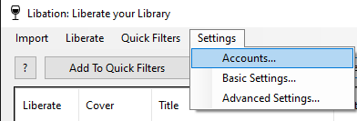

New locale options include many more regions including old audible accounts which pre-date the amazon acquisition

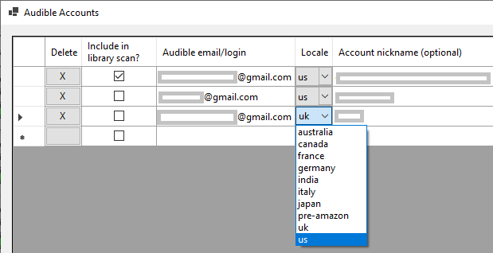

### Import your library

Select Import > Scan Library:

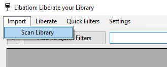

Or if you have multiple accounts, you'll get to choose whether to scan all accounts or just the ones you select:

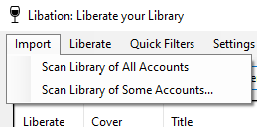

If this is a new installation, or you're scanning an account you haven't scanned before, you'll be prompted to enter your password for the Audible account.


Enter the password and click Submit. Audible will prompt you with a CAPTCHA image. 


Enter the CAPTCHA answer characters and click Submit. If all has gone well, Libation will start scanning the account. 

In rare instances, the Captcha image/response will fail in an endless loop. If this happens, delete the problem account, and then click Save. Re-add the account and click Save again. Now try to scan the account again. This time, instead of typing your password, click the link that says "Or click here". This will open the Audible External Login dialog shown below.

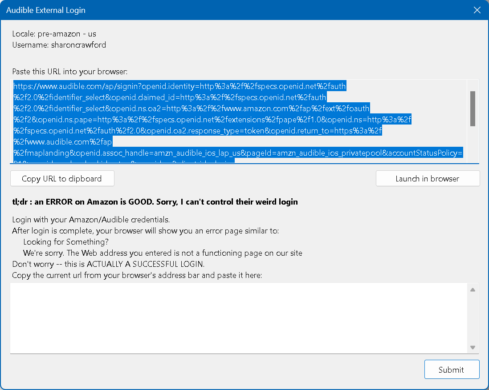

You can either copy the URL shown and paste it into your browser or launch the browser directly by clicking Launch in Browser. Audible will display its standard login page. Login, including answering the CAPTCHA on the next page. In some cases, you might have to approve the login from the email account associated with that login, but once the login is successful, you'll see an error message.

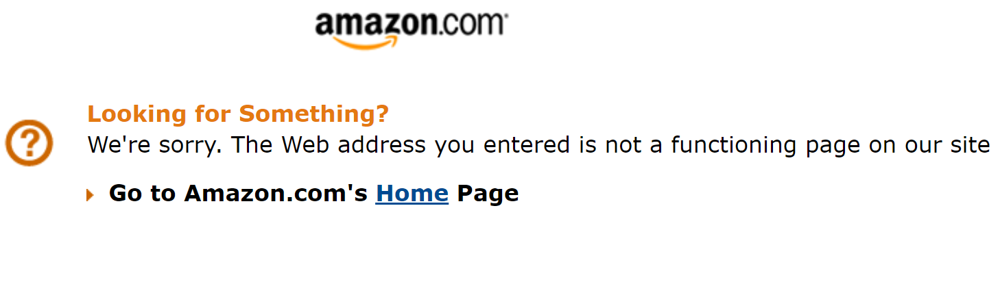

This actually means you've successfully logged in. Copy the entire URL shown in your browser and return to Libation. Paste that URL into the text box at the bottom of the Audible External Login window and click Submit.

You'll see this window while it's scanning:


Success! We see how many new titles are imported:


### Download your books -- DRM-free!

Automatically download some or all of your audible books. This shows you how much of your library is not yet downloaded and decrypted:

The stoplights will tell you a title's status:

* Green: downloaded and decrypted
* Yellow: downloaded but still encrypted with DRM
* Red: not downloaded
* PDF icon without arrow: downloaded
* PDF with arrow: not downloaded

Or hover over the button to see the status.

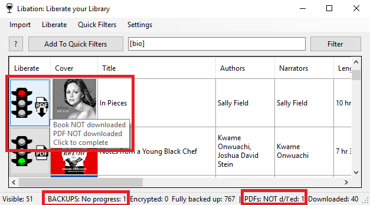

Select Liberate > Begin Book Backups

You can also click on the stop light to download only that title and its PDF

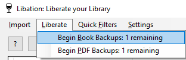

First the original book with DRM is downloaded


Then it's decrypted so you can use it on any device you choose. The very first time you decrypt a book, this step will take a while. Every other book will go much faster. The first time, Libation has to figure out the special decryption key which allows your personal books to be unlocked.

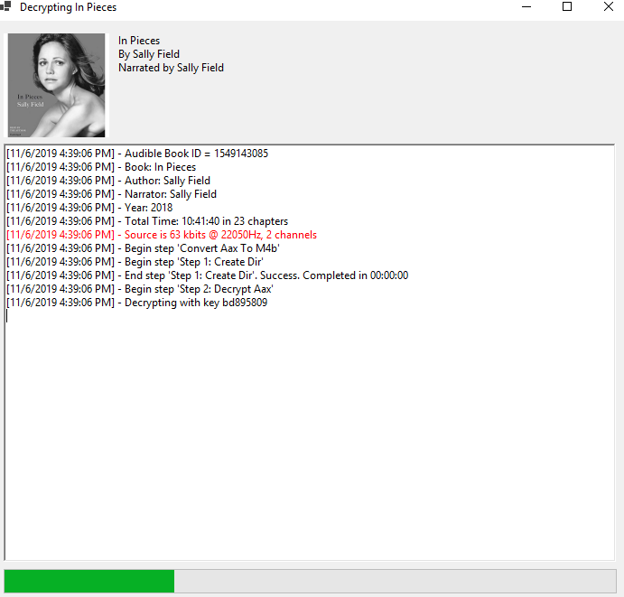

And voila! If you have multiple books not yet liberated, Libation will automatically move on to the next.

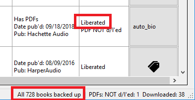

The Audible id must be somewhere in the book's file or folder name for Libation to detect your downloaded book.

### Download PDF attachments

For books which include PDF downloads, Libation can download these for you as well and will attempt to store them with the book. "Book backup" will already download an available PDF. This additional option is useful when Audible adds a PDF to your book after you've already backed it up.

Select Liberate > Begin PDF Backups


The downloads work just like with books, only with no additional decryption needed.

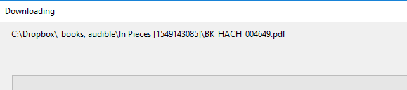

### Details of downloaded files


When you set up Libation, you'll specify a Books directory. Libation looks inside that directory and all subdirectories to look for files or folders with each library book's audible id. This way, organization is completely up to you. When you download + decrypt a book, you get several files

* .m4b: your audiobook in m4b format. This is the most pure version of your audiobook and retains the highest quality. Now that it's decrypted, you can play it on any audio player and put it on any device. If you'd like, you can also use 3rd party tools to turn it into an mp3. The freedom to do what you want with your files was the original inspiration for Libation.
* .cue: this is a file which logs where chapter breaks occur. Many tools are able to use this if you want to split your book into files along chapter lines.

### Export your library

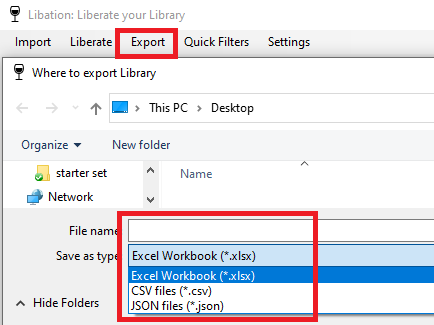

Export your library to Excel, CSV, or JSON

## Searching and filtering

### Tags

To add tags to a title, click the tags button

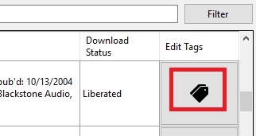

Add as many tags as you'd like. Tags are separated by a space. Each tag can contain letters, numbers, and underscores


Tags are saved non-case specific for easy search. There is one special tag "hidden" which will also grey-out the book

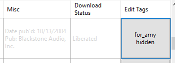

To edit tags, just click the button again.

### Searches

Libation's advanced searching is built on the powerful Lucene search engine. Simple searches are effortless and powerful searches are simple. To search, just type and click Filter or press enter

* Type anything in the search box to search common fields: title, authors, narrators, and the book's audible id
* Use Lucene's "Query Parser Syntax" for advanced searching.
    * Easy tutorial: http://www.lucenetutorial.com/lucene-query-syntax.html
    * Full official guide: https://lucene.apache.org/core/2_9_4/queryparsersyntax.html
* Tons of search fields, specific to audiobooks
* Synonyms so you don't have to memorize magic words. Eg: author and author**s** will both work
* Click [?] button for a full list of search fields and synonyms 
* Search by tag like \[this\]
* When tags have an underscore you can use part of the tag. This is useful for quick categories. The below examples make this more clear.

### Search examples

Search for anything with the word potter

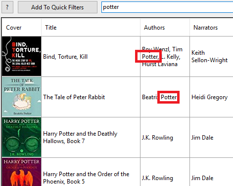

If you only want to see Harry Potter

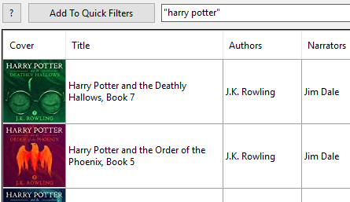

If you only want to see potter except for Harry Potter. You can also use "-" instead of "NOT"

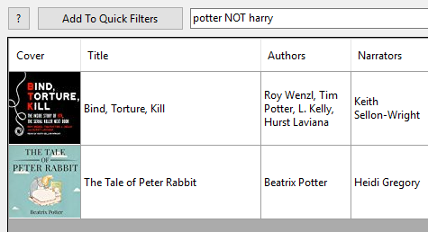
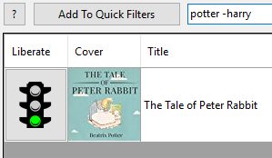

To see only books written by Neil Gaiman where he also narrates his own book. (If you don't include AND, you'll see everything written by Neil Gaiman and also all books in your library which are self-narrated.)

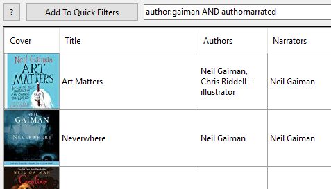

I tagged autobiographies as auto_bio and biographies written by someone else as bio. I can get only autobiographies with \[auto_bio\] or get both by searching \[bio\]

![Search example: \[bio\]](images/SearchExampleBio.png)
![Search example: \[auto_bio\]](images/SearchExampleAutoBio.png)

### Filters

If you have a search you want to save, click Add To Quick Filters to save it in your Quick Filters list. To use it again, select it from the Quick Filters list.

To edit this list go to Quick Filters > Edit quick filters. Here you can re-order the list, delete filters, double-click a filter to edit it, or double-click the bottom blank box to add a new filter.

Check "Quick Filters > Start Libation with 1st filter Default" to have your top filter automatically applied when Libation starts. In this top example, I want to always start without these: at books I've tagged hidden, books I've tagged as free_audible_originals, and books which I have rated.

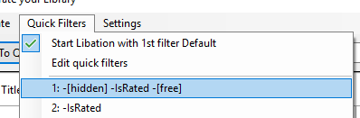

## Advanced

### Files and folders

To make upgrades and reinstalls easier, Libation separates all of its responsibilities to a few different folders. If you don't want to mess with this stuff: ignore it. Read on if you like a little more control over your files.

* In Libation's initial folder are the files that make up the program. Since nothing else is here, just copy new files here to upgrade the program. Delete this folder to delete Libation.

* In a separate folder, Libation keeps track of all of the files it creates like settings and downloaded images. After an upgrade, Libation might think that's its being run for the first time. Just click ADVANCED SETUP and point to this folder. Libation will reload your library and settings.

* The last important folder is the "books location." This is where Libation looks for your downloaded and decrypted books. This is how it knows which books still need to be downloaded. The Audible id must be somewhere in the book's file or folder name for Libation to detect your downloaded book.

### Linux and Mac

Although Libation only currently officially supports Windows, some users have had success with WINE. ([Linux](https://github.com/rmcrackan/Libation/issues/28#issuecomment-890594158), [OSX Crossover and WINE](https://github.com/rmcrackan/Libation/issues/150#issuecomment-1004918592))

### Settings

* Allow Libation to fix up audiobook metadata. After decrypting a title, Libation attempts to fix details like chapters and cover art. Some power users and/or control freaks prefer to manage this themselves. By unchecking this setting, Libation will only decrypt the book and will leave metadata as-is, warts and all.

### Custom File Naming

In Settings, on the Download/Decrypt tab, you can specify the format in which you want your files to be named. As you edit these templates, a live example will be shown. Parameters are listed for folders, files, and files split by chapter including an explanation of what each naming option means. For instance: you can use template `<title short> - <ch# 0> of <ch count> - <ch title>` to create the file `A Study in Scarlet - 04 of 10 - A Flight for Life.m4b`.

These templates apply to GUI and CLI.

### Command Line Interface

Libationcli.exe allows limited access to Libation's functionalities as a CLI.

Warnings about relying solely on on the CLI:
* CLI will not perform any upgrades.
* It will show that there is an upgrade, but that will likely scroll by too fast to notice.
* It will not perform all post-upgrade migrations. Some migrations are only be possible by launching GUI.

```
help
  libationcli --help
  
verb-specific help
  libationcli scan --help
  
scan all libraries
  libationcli scan
scan only libraries for specific accounts
  libationcli scan nickname1 nickname2
  
convert all m4b files to mp3
  libationcli convert
  
liberate all books and pdfs
  libationcli liberate
liberate pdfs only
  libationcli liberate --pdf
  libationcli liberate -p
  
export library to file
  libationcli export --path "C:\foo\bar\my.json" --json
  libationcli export -p "C:\foo\bar\my.json" -j
  libationcli export -p "C:\foo\bar\my.csv" --csv
  libationcli export -p "C:\foo\bar\my.csv" -c
  libationcli export -p "C:\foo\bar\my.xlsx" --xlsx
  libationcli export -p "C:\foo\bar\my.xlsx" -x
```
