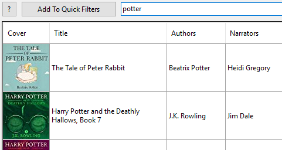
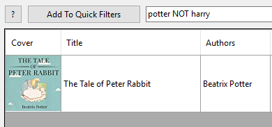

# Searching and filtering

### Tags

To add tags to a title, click the tags button

Add as many tags as you'd like. Tags are separated by a space. Each tag can contain letters, numbers, and underscores

Tags are saved non-case specific for easy search. There is one special tag "hidden" which will also grey-out the book

To edit tags, just click the button again.

### Searches

Libation's advanced searching is built on the powerful Lucene search engine. Simple searches are effortless and powerful searches are simple. To search, just type and click Filter or press enter

* Type anything in the search box to search common fields: title, authors, narrators, and the book's audible id
* Use Lucene's "Query Parser Syntax" for advanced searching.
    * Easy tutorial: http://www.lucenetutorial.com/lucene-query-syntax.html
    * Full official guide: https://lucene.apache.org/core/2_9_4/queryparsersyntax.html
* Tons of search fields, specific to audiobooks
* Synonyms so you don't have to memorize magic words. Eg: author and author**s** will both work
* Click [?] button for a full list of search fields and synonyms 
* Search by tag like \[this\]
* When tags have an underscore you can use part of the tag. This is useful for quick categories. The below examples make this more clear.

### Search examples

Search for anything with the word potter

If you only want to see Harry Potter

If you only want to see potter except for Harry Potter. You can also use "-" instead of "NOT"

To see only books written by Neil Gaiman where he also narrates his own book. (If you don't include AND, you'll see everything written by Neil Gaiman and also all books in your library which are self-narrated.)

I tagged autobiographies as auto_bio and biographies written by someone else as bio. I can get only autobiographies with \[auto_bio\] or get both by searching \[bio\]

![Search example: \[bio\]](../images/SearchExampleBio.png)
![Search example: \[auto_bio\]](../images/SearchExampleAutoBio.png)

### Filters

If you have a search you want to save, click Add To Quick Filters to save it in your Quick Filters list. To use it again, select it from the Quick Filters list.

To edit this list go to Quick Filters > Edit quick filters. Here you can re-order the list, delete filters, double-click a filter to edit it, or double-click the bottom blank box to add a new filter.

Check "Quick Filters > Start Libation with 1st filter Default" to have your top filter automatically applied when Libation starts. In this top example, I want to always start without these: at books I've tagged hidden, books I've tagged as free_audible_originals, and books which I have rated.

