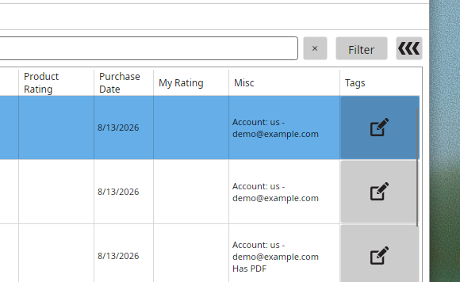
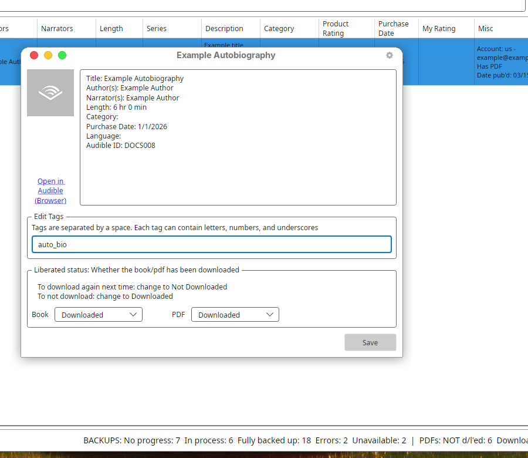
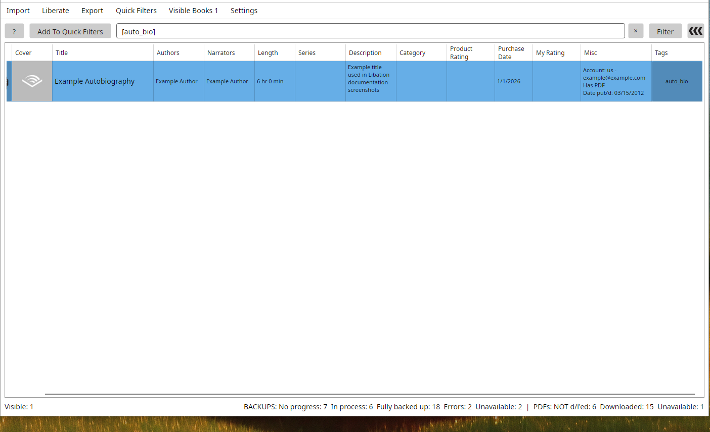
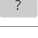
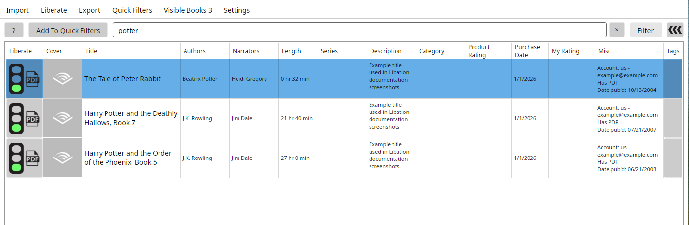
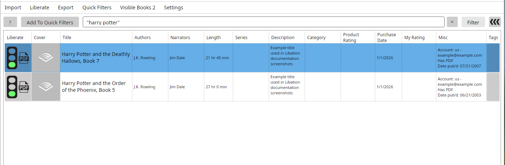
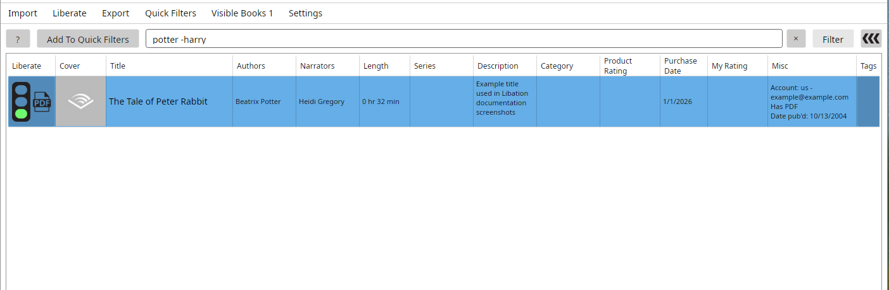
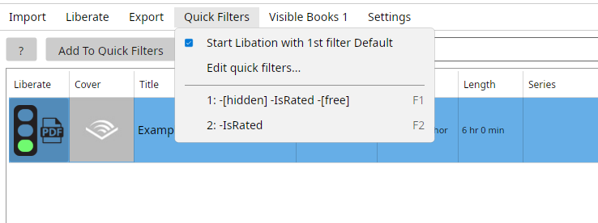

# Searching and Filtering

## Tags

To add tags to a title, click the tags button

Add as many tags as you'd like. Tags are separated by a space. Each tag can contain letters, numbers, and underscores

Tags are saved non-case specific for easy search. There is one special tag "hidden" which will also grey-out the book

To edit tags, just click the button again.

## Searches

Libation's advanced searching is built on the powerful Lucene search engine. Simple searches are effortless and powerful searches are simple. To search, just type and click Filter or press enter

- Type anything in the search box to search common fields: title, authors, narrators, and the book's audible id
- Use Lucene's "Query Parser Syntax" for advanced searching.
  - [Easy guide to searching](lucene.md)
  - [Full official guide](https://lucene.apache.org/core/2_9_4/queryparsersyntax.html)
- Tons of search fields, specific to audiobooks
- Synonyms so you don't have to memorize magic words. Eg: author and author**s** will both work
- Click [?] button for a full list of search fields and synonyms 
- Search by tag like \[this\]
- When tags have an underscore you can use part of the tag. This is useful for quick categories. The below examples make this more clear.

## Search Examples

Search for anything with the word potter

If you only want to see Harry Potter

If you only want to see potter except for Harry Potter. You can also use "-" instead of "NOT"

To see only books written by Stephen Fry where he also narrates his own book. (If you don't include AND, you'll see everything written by Stephen Fry and also all books in your library which are self-narrated.)

`author:fry AND authornarrated`

I tagged autobiographies as auto_bio and biographies written by someone else as bio. I can get only autobiographies with \[auto_bio\] or get both by searching \[bio\]

![Search example: [bio]](../images/SearchExampleBio.png)
![Search example: [auto_bio]](../images/SearchExampleAutoBio.png)

## When a search term could mean two things

Some of what you type is read as a field rather than as the words themselves, because that is usually what you meant. Naming the field settles it.

A word that is also a search field means the field. Typing `absent` finds the books Audible no longer lists, not books with "absent" in the title, and the same goes for `podcast`, `finished`, `spatial` and the rest. The [?] button lists every one of them, which is the quickest way to check whether a word you want to search for is also a keyword.

- `absent` - books missing from your last scan
- `title:absent` - books with "absent" in the title
- `title:absent AND -absent` - the word, on books that are still listed

A number is searched as both text and a number at once, because a number can be a title or a length, a rating or a date. `1984` finds Orwell's novel and every book 1984 minutes long; `14` finds Peter Clines' novel and everything fourteen minutes or fourteen hours long. Name the field to get one or the other.

- `1984` - the novel, and anything that measures 1984
- `title:1984` - only the novel
- `length:1984` - only books 1984 minutes long

## Subtitles and short titles

The `<title short>` tag keeps everything before the first colon, which is what keeps the default folder name short. That is usually what you want, but not always. "A Book Series Omnibus: Volume One" and "A Book Series Omnibus: Volume Two" both shorten to "A Book Series Omnibus", so the two books land in the same folder and can no longer be told apart by name.

A colon is not something you can search for: the search engine throws punctuation away when it indexes your library, and Lucene reads a colon in a query as the separator between a field and its value. Two boolean fields find these books instead.

| Field                            | Matches                                                                                                       |
|----------------------------------|---------------------------------------------------------------------------------------------------------------|
| `HasSubtitle` (`HasSubtitles`)   | Audible sent a separate subtitle, which every title tag except `<title>` leaves out                            |
| `TitleHasColon` (`ColonInTitle`) | Audible's title itself contains a colon, so `<title short>` cuts into the title rather than dropping a subtitle |

Some searches worth keeping as quick filters:

- `TitleHasColon` - every book whose title `<title short>` cuts
- `TitleHasColon AND -IsLiberated` - the same, limited to books you have not downloaded yet
- `HasSubtitle OR TitleHasColon` - everything shortening changes in any way
- `-HasSubtitle AND -TitleHasColon` - the books shortening cannot change

If these fields find nothing at all, your search index was built before they existed. Scanning your library rebuilds it, as does closing Libation and deleting the `SearchEngine` folder in your Libation files folder. The index is only a cache of your library, so deleting it is safe.

Once you can see the affected books, you can decide what to do about them. If the only problem is colons inside Audible's titles, switching `<title short>` to `<audible title>` in Settings > Download/Decrypt fixes every one of them at once: it still leaves out Audible's subtitle, but it never cuts the title. If instead two books share a title and differ only by subtitle, use `<title>` for those books, or keep `<id>` in the template so their names stay unique. Either way, filter to the books you want handled differently, liberate them with one template, then restore your usual template for the rest.

### Auditing titles in a spreadsheet

The filter tells you which books are shortened. It cannot tell you which ones actually collide, and a colon on its own is harmless - the damage is done when two books end up with the same name. Export (Export in the menu bar) writes `Title` and `Subtitle` as separate columns, where `Title` is Audible's title exactly as `<title short>` sees it, so a spreadsheet can answer the question the filter cannot.

Put this beside the Title column to see the name each book would be shortened to, then use `COUNTIF` on the result to find the ones that repeat:

`=LEFT(A2, IFERROR(FIND(":", A2) - 1, LEN(A2)))`

To carry the result back into Libation, paste the affected ids into the filter box joined by OR, eg. `id:B015D78L0U OR id:B01LYFDNZM`, which selects exactly those books in the grid.

## Filters

If you have a search you want to save, click Add To Quick Filters to save it in your Quick Filters list. To use it again, select it from the Quick Filters list.

To edit this list go to Quick Filters > Edit quick filters. Here you can re-order the list, delete filters, double-click a filter to edit it, or double-click the bottom blank box to add a new filter.

Check "Quick Filters > Start Libation with 1st filter Default" to have your top filter automatically applied when Libation starts. In this top example, I want to always start without these: at books I've tagged hidden, books I've tagged as free_audible_originals, and books which I have rated.

